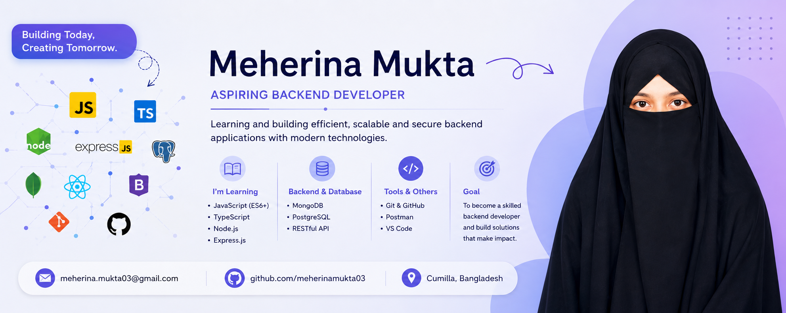

<!---banner--->

<h1 align="center">Hi 👋, I'm Meherina Mukta</h1>
<h3 align="center">I am interested in backend development.</h3>

💻 I’m interested in Web Development.

🌱 I’m currently learning JavaScript and TypeScript.

🖥️ I’m learning HTML, CSS, React.js and Node.js.

🗄️ I’m interested in Backend Development.

📚 I enjoy learning new technologies and improving my programming skills.

🎯 My goal is to become a professional Full-Stack Web Developer.

📫 Feel free to reach me out. <a href="mailto:meherinamukta03@gmail.com">meherinamukta03@gmail.com</a>

<h3 align="left">Connect with me:</h3>

## 🛠️ Tech Stack

### 💻 Languages

  

### 🎨 Frontend

  

### ⚙️ Backend

  

### 🗄️ Database

  

<h3>📚 Currently Learning</h3>

  

&nbsp;

